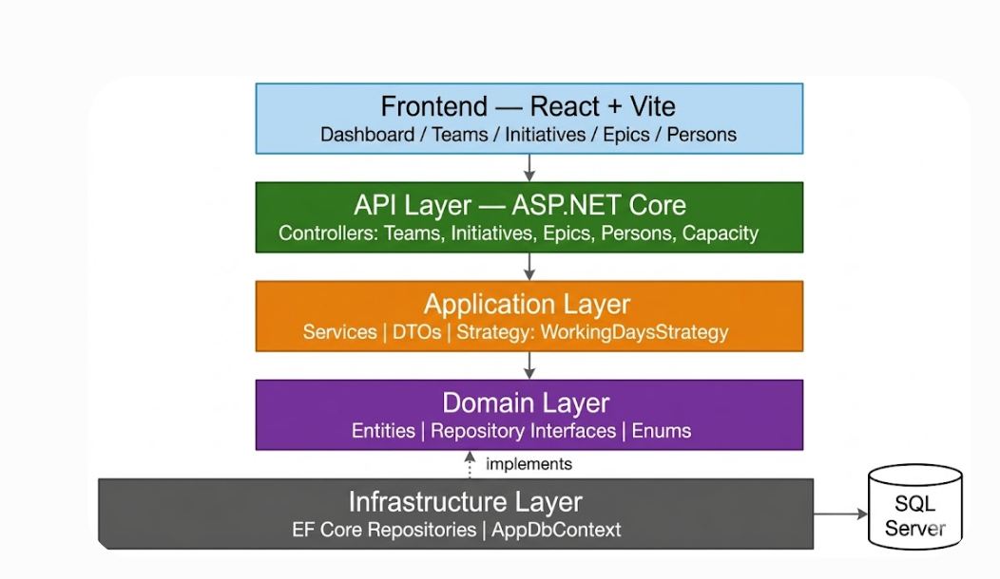
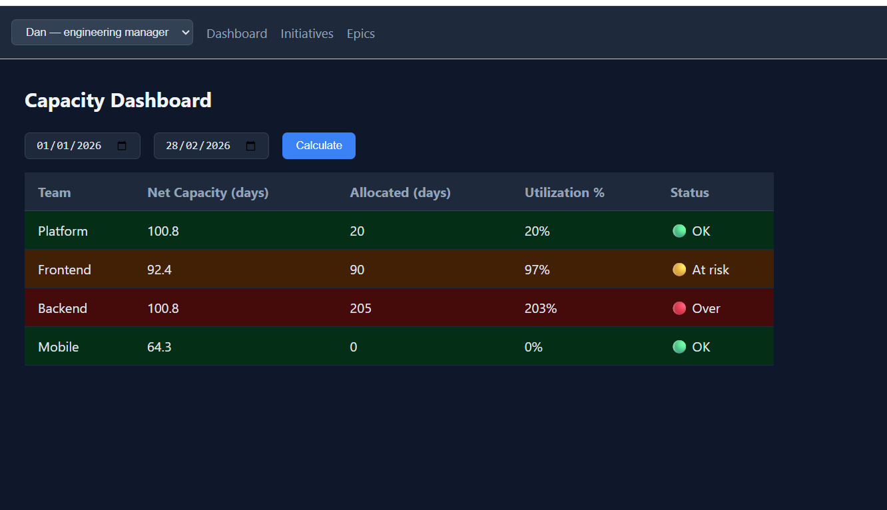

# Capacity Planning Tool — Prototype

A web-based strategic capacity planning tool for a mid-size company.

## Tech Stack
| Layer | Technology |
|---|---|
| Backend | .NET 6, ASP.NET Core Web API |
| ORM | Entity Framework Core 6 + SQL Server |
| Frontend | React + Vite |
| API Docs | Swagger (Swashbuckle) |


## Architecture
The backend follows **Clean Architecture** with 4 layers:
- **CapacityPlanning.Domain**          → Entities, interfaces, enums (no dependencies)
- **CapacityPlanning.Application**     → DTOs, service interfaces, business logic
- **CapacityPlanning.Infrastructure**  → EF Core, repositories, DB configurations
- **CapacityPlanning.API**             → Controllers, DI wiring, HTTP layer




**Design patterns used:**
- **Repository Pattern** — abstracts data access; business logic never touches EF Core directly
- **Strategy Pattern** — `ICapacityCalculationStrategy` / `WorkingDaysStrategy` isolates the capacity formula; swappable without touching `CapacityService`

## Data Model

- **Team ──< Person**        (one team has many members)
- **Team ──< Epic**         (one team owns many epics)
- **Initiative ──< Epic**    (one initiative has many epics)

**Capacity formula (WorkingDaysStrategy):**

**rawCapacity**  = Σ (person.availabilityPercentage / 100 × workingDaysInPeriod)

Raw capacity represents the theoretical maximum output of a team in a given period, computed as the sum of each member's availability multiplied by the 
number of working days. It does not count team overhead such as meetings, code reviews, or support duties — that reduction is applied separately to obtain net capacity.

**netCapacity**  = rawCapacity × (1 − team.overheadPercentage / 100)
Net capacity is the realistic available effort after subtracting team overhead from raw capacity. Overhead is configured per team as a percentage (defaulting to 20%) 
and captures recurring non-project activities such as meetings, code reviews, and support duties. Net capacity is the denominator used to compute utilization — 
the primary signal for identifying over- or under-allocated teams.

**allocatedDays** = sum of `estimatedDays` for all epics assigned to the team within the selected date range

**utilization**  = allocatedDays / netCapacity × 100


## Features

| Feature | Stakeholder |
|---|---|
| Capacity dashboard — per-team utilization (green/yellow/red) | Higher Management, Engineering Manager, Team Lead |
| Initiatives list with priority and target date | Higher Management, Engineering Manager |
| Epics list with team assignment and estimated effort | Engineering Manager |
| Team members management with individual availability % | Team Lead |
| Team overhead configuration | Team Lead |
| Role-based navigation — 3 simulated users (Ana, Dan, Sara) | All |

## Assumptions

**1. Effort unit = working days**
The document mentions "estimated effort" without specifying the unit. I chose working days (Mon–Fri, no holidays) as the most universally understood unit at initiative/epic level.

**2. No status field on Initiative or Epic**
The document does not mention status tracking. I initially added it but removed it because it was not used in any business logic. A real implementation would use epic status to exclude `Done`/`Cancelled` work from capacity calculations.

**3. Capacity is calculated per date range, not per sprint**
The document does not define planning periods, I chose free-form date ranges so the tool works for any custom planning window.

**4. No authentication**
The document mentions three stakeholder groups but does not require login. I simulated role-based views with a user dropdown (Ana = Higher Management, Dan = Engineering Manager, Sara = Team Lead).

**5. One team per epic**
The document says an epic "belongs to one team." A team can have multiple epics, but an epic belongs to only one team.

**6. Overhead is a team-level percentage**
Modeled as a fixed percentage (default 20%) applied to raw capacity to get net available capacity.


## Future improvements

| Feature | Reason |
|---|---|
| Planning simulations / what-if | Higher complexity, out of 4h scope |
| Update/edit for initiatives and epics | Prioritized read + create + delete for the demo |
| Authentication | Simulated with role selector |
| Epic status affecting capacity calculation | Removed status entirely — see assumptions |

## How to Run Locally

**Requirements:** .NET 6 SDK, SQL Server, Node.js 18+

**Backend:**
```bash
cd backend
# Set your SQL Server in CapacityPlanning.API/appsettings.Development.json
dotnet run --project CapacityPlanning.API
# Swagger: https://localhost:7154/swagger
Frontend:
cd frontend
npm install
npm run dev
# App: http://localhost:5173
The database and seed data (4 teams, 10 members, 3 initiatives, 6 epics) are created automatically on first run.


